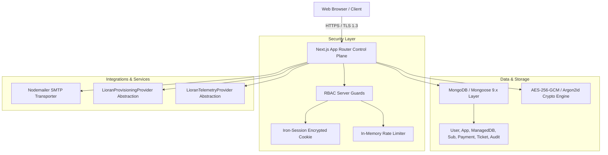
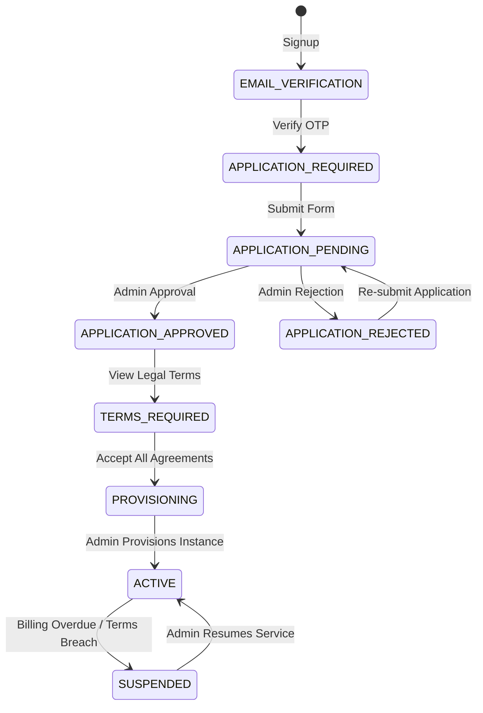

# LioranDB Managed Hosting — System Architecture

**Document Version:** 1.0  
**Target Domain:** `https://app.liorandb.com`

---

## 1. Architectural Philosophy

LioranDB Managed Hosting is designed with high reliability, security-at-rest, strict role-based access control, and complete lifecycle auditability. It operates as an independent Next.js 16 App Router full-stack system communicating directly with MongoDB, avoiding multi-hop backend proxies.



---

## 2. Authentication & Cryptographic Infrastructure

### A. Argon2id Password Hashing
Password hashes are computed using standard Argon2id:
- **Memory Cost:** `65536 KB` (64 MB)
- **Time Cost:** `2 iterations`
- **Parallelism:** `1 thread`
- **Password Strength:** Minimum 10 characters requiring uppercase, lowercase, numeric digit, and special symbol.

### B. Field-Level AES-256-GCM Encryption
Sensitive credentials (such as provisioned database connection URIs containing administrative passwords) are never stored in plaintext.
- **Cipher:** `aes-256-gcm`
- **IV Length:** 12 bytes (cryptographically randomized per entry)
- **Auth Tag:** 16 bytes authentication tag
- **Storage Format:** `iv:tag:ciphertext` (hexadecimal string)
- **Key Source:** `CREDENTIAL_ENCRYPTION_KEY` environment variable (32 bytes / 64 hex characters).

### C. Anti-Enumeration Email Verification & Password Reset
- **Verification OTP:** 6-digit numeric string generated via `crypto.randomBytes(4)`. Stored as a SHA-256 hash with a 10-minute TTL index in MongoDB.
- **Password Reset:** 32-byte cryptographically secure token stored as a SHA-256 hash with a 1-hour expiration.
- **Timing Defense:** Forgot password requests always return HTTP 200 with identical messages regardless of email existence.

---

## 3. Customer Lifecycle State Machine

The onboarding journey is governed by a finite state machine enforced in [`src/lib/auth/guards.ts`](file:///c:/pro_projects/app-liorandb-com/src/lib/auth/guards.ts) and page renderers:



---

## 4. Role-Based Access Control (RBAC)

The application defines three distinct roles:
1. **`customer`**: Standard user with access to their own dashboard, applications, database credentials, billing history, and support tickets.
2. **`support`**: Technical support staff with access to the Support Console (`/support-console`), ticket handling, and internal notes.
3. **`admin`**: Full super-administrator with access to the Admin Control Center (`/admin`), application review, instance provisioning, manual payment recording, user role modifications, and system audit logs.

### Server Guard Implementation
```typescript
// Server Components & Actions
const user = await requireRole('admin');
const staff = await requireAnyRole(['admin', 'support']);

// API Route Handlers
const user = await requireRoleAPI('admin');
const staff = await requireAnyRoleAPI(['admin', 'support']);
```

---

## 5. Billing & Indian Standard Time (IST) Engine

All billing calculations are explicitly calculated in the **`Asia/Kolkata` (IST)** timezone:
- **Billing Due Date:** 1st day of every calendar month at 00:00:00 IST.
- **Monthly Fee:** Fixed at ₹5,000 INR per active database instance.
- **Offline Payment Ledger:** Manual bank transfers, UPI transactions, and NEFT payments are recorded by administrators with transaction references (UTR/Bank Ref). Recording a payment advances the `nextPaymentDate` to the 1st of the subsequent month.

---

## 6. Provider Abstractions

### Provisioning Interface (`LioranProvisioningProvider`)
Decouples dashboard management from underlying infrastructure orchestration:
```typescript
export interface LioranProvisioningProvider {
  createDeployment(params: ProvisionParams): Promise<ProvisionResult>;
  suspendDeployment(deploymentId: string, reason?: string): Promise<void>;
  resumeDeployment(deploymentId: string): Promise<void>;
  terminateDeployment(deploymentId: string): Promise<void>;
}
```

### Telemetry Interface (`LioranTelemetryProvider`)
Provides hooks for instance health status, IOPS, read/write ops, and document counts.

